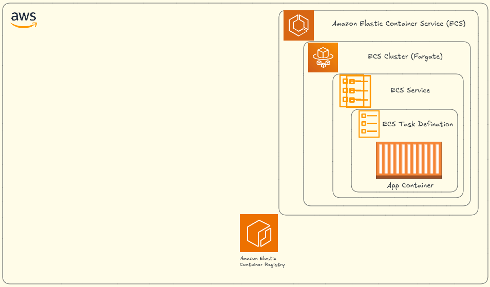

<div align="center">
  


# AWS ECS Fargate Nginx Deployment – Configuração Completa de Infraestrutura com AWS CLI

**Atualizado: 14 de Janeiro de 2026**

[](https://github.com/nicoleepaixao)
[](https://github.com/nicoleepaixao/aws-ecs-fargate-nginx-awscli)
[](https://nicoleepaixao.medium.com/)

<p align="center">
  <a href="README-PT.md">🇧🇷</a>
  <a href="README.md">🇺🇸</a>
</p>

</div>

---

<p align="center">
  
</p>

## **O Problema**

Configurar um serviço ECS Fargate com Nginx manualmente envolve criar múltiplos recursos AWS na ordem correta. Toda vez que você precisa provisionar infraestrutura, gasta **até 1 hora** criando recursos individualmente e revisando configurações. Além disso, as chances de cometer erros são altas, especialmente em relação a permissões, configurações de rede e integração ALB.

Este projeto resolve esse problema documentando a **configuração completa de infraestrutura** usando comandos AWS CLI para **dois cenários**: usando um ALB existente ou criando um do zero. O resultado é um **processo repetível e pronto para produção** que reduz o tempo de setup em 95%.

---

## **Objetivo**

Criar uma **configuração completa de infraestrutura** que:

- Implanta **Nginx** no **ECS Fargate**
- Atrás de um **Application Load Balancer (ALB)**
- Em **subnets privadas** (melhor prática)
- Com logs no **CloudWatch Logs**
- Usa **ECR** para registro de imagem de container
- Implementa **security groups** e **IAM roles** adequados

Este guia cobre **dois cenários**:

**Cenário A** — ALB **já existe**  
**Cenário B** — Criar um **ALB do zero** usando AWS CLI

---

## **Visão Geral da Arquitetura ECS Fargate**

**Entendendo Amazon ECS Fargate:**

Amazon ECS (Elastic Container Service) com Fargate é uma plataforma de orquestração de containers serverless. Diferente do tipo de lançamento EC2, Fargate gerencia a infraestrutura subjacente automaticamente, eliminando a necessidade de provisionar ou escalar servidores.

**Componentes Principais:**

| **Componente** | **Propósito** |
|---------------|------------|
| **Cluster** | Agrupamento lógico de tasks e services |
| **Task Definition** | Blueprint definindo especificações de container (image, CPU, memory, ports) |
| **Service** | Mantém número desejado de tasks executando e integra com load balancers |
| **Task** | Instância em execução de uma task definition (um ou mais containers) |
| **Target Group** | Roteia tráfego ALB para tasks ECS usando targets baseados em IP |

**Modo de Rede: awsvpc**

ECS Fargate requer modo de rede `awsvpc`, o que significa:
- Cada task recebe sua própria Elastic Network Interface (ENI)
- Tasks recebem endereços IP privados das subnets VPC
- Security groups são aplicados diretamente às tasks
- Tasks podem se comunicar com outros serviços AWS via VPC endpoints

---

## **Estrutura do Projeto**

```text
aws-ecs-fargate-nginx-awscli/
│
├── README.md                     # Documentação completa
├── Dockerfile                    # Imagem de container Nginx
├── nginx.conf                    # Configuração customizada Nginx
├── html/
│   └── index.html               # Página HTML estática
├── aws/
│   ├── taskdef-nginx.json       # Task definition (prod)
│   └── taskdef-nginx-homol.json # Task definition (homol)
└── iam/
    └── ecs-taskrole-trust.json  # Política de confiança task role
```

---

## **Configuração do Container**

**Dockerfile:**

```dockerfile
FROM nginx:1.27-alpine

# Copiar configuração customizada Nginx
COPY nginx.conf /etc/nginx/nginx.conf

# Copiar arquivos estáticos
COPY html /usr/share/nginx/html

EXPOSE 80

HEALTHCHECK --interval=30s --timeout=5s --retries=3 CMD \
  wget -qO- http://127.0.0.1/healthz || exit 1
```

**nginx.conf:**

```nginx
events {}

http {
  server {
    listen 80;

    location / {
      root   /usr/share/nginx/html;
      index  index.html;
    }

    location /healthz {
      return 200 'ok';
      add_header Content-Type text/plain;
    }
  }
}
```

**html/index.html:**

```html
<!DOCTYPE html>
<html>
<head>
  <title>Nginx ECS - Stage</title>
</head>
<body>
  <h1>Deu bom! Nginx rodando no ECS 🎉</h1>
</body>
</html>
```

---

## **Passo 1: Configuração CloudWatch Logs**

Criar log group para logs de container:

```bash
aws logs create-log-group \
  --log-group-name /ecs/nginx \
  --region us-east-1
```

Definir política de retenção (30 dias):

```bash
aws logs put-retention-policy \
  --log-group-name /ecs/nginx \
  --retention-in-days 30 \
  --region us-east-1
```

---

## **Passo 2: Criar Repositório ECR**

Criar repositório para imagens Nginx:

```bash
aws ecr create-repository \
  --repository-name ecr_nginx \
  --image-tag-mutability MUTABLE \
  --image-scanning-configuration scanOnPush=true \
  --region us-east-1
```

Obter URI do repositório:

```bash
aws ecr describe-repositories \
  --repository-names ecr_nginx \
  --query 'repositories[0].repositoryUri' \
  --output text \
  --region us-east-1
```

**Salve este URI** - você precisará dele nas task definitions.

---

## **Passo 3: IAM Roles para ECS Tasks**

**Criar política de confiança** `iam/ecs-taskrole-trust.json`:

```json
{
  "Version": "2012-10-17",
  "Statement": [
    {
      "Effect": "Allow",
      "Principal": {
        "Service": "ecs-tasks.amazonaws.com"
      },
      "Action": "sts:AssumeRole"
    }
  ]
}
```

Criar a task role:

```bash
aws iam create-role \
  --role-name ecsTaskRole-nginx \
  --assume-role-policy-document file://iam/ecs-taskrole-trust.json
```

**Opcional** — anexar políticas para testes (remover em produção):

```bash
aws iam attach-role-policy \
  --role-name ecsTaskRole-nginx \
  --policy-arn arn:aws:iam::aws:policy/ReadOnlyAccess
```

**Nota:** A execution role (`ecsTaskExecutionRole`) é tipicamente criada automaticamente pela AWS, mas se necessário:

```bash
aws iam create-role \
  --role-name ecsTaskExecutionRole \
  --assume-role-policy-document file://iam/ecs-taskrole-trust.json

aws iam attach-role-policy \
  --role-name ecsTaskExecutionRole \
  --policy-arn arn:aws:iam::aws:policy/service-role/AmazonECSTaskExecutionRolePolicy
```

---

## **Cenário A: Usando um ALB Existente**

**Passo 4A: Obter VPC do ALB existente:**

```bash
aws elbv2 describe-load-balancers \
  --load-balancer-arns <ALB_ARN_EXISTENTE> \
  --query 'LoadBalancers[0].VpcId' \
  --output text \
  --region us-east-1
```

---

**Passo 5A: Criar Target Group (Fargate requer target-type: ip):**

```bash
aws elbv2 create-target-group \
  --name tg-nginx-stage \
  --protocol HTTP \
  --port 80 \
  --vpc-id <VPC_ID> \
  --target-type ip \
  --health-check-path /healthz \
  --health-check-port traffic-port \
  --health-check-interval-seconds 30 \
  --healthy-threshold-count 3 \
  --unhealthy-threshold-count 3 \
  --matcher HttpCode=200 \
  --region us-east-1
```

Obter ARN do Target Group:

```bash
aws elbv2 describe-target-groups \
  --names tg-nginx-stage \
  --query 'TargetGroups[0].TargetGroupArn' \
  --output text \
  --region us-east-1
```

---

**Passo 6A: Listar listeners do ALB:**

```bash
aws elbv2 describe-listeners \
  --load-balancer-arn <ALB_ARN_EXISTENTE> \
  --region us-east-1
```

Escolha **listener HTTPS :443** (ou HTTP :80 para lab) e copie o `ListenerArn`.

---

**Passo 7A: Criar regra de listener (roteamento baseado em path):**

```bash
aws elbv2 create-rule \
  --listener-arn <LISTENER_ARN_HTTPS_443> \
  --priority 110 \
  --conditions Field=path-pattern,Values="/nginx/*" \
  --actions Type=forward,TargetGroupArn=<TARGET_GROUP_ARN> \
  --region us-east-1
```

Qualquer requisição para:
```
https://seu-dominio.com/nginx/...
```

Será encaminhada para `tg-nginx-stage` → ECS tasks.

---

## **Cenário B: Criando ALB do Zero**

**Passo 4B: Criar security group para ALB:**

```bash
aws ec2 create-security-group \
  --group-name alb-nginx-stage-sg \
  --description "Security Group para nginx stage ALB" \
  --vpc-id <VPC_ID> \
  --region us-east-1
```

Permitir tráfego HTTP e HTTPS:

```bash
# HTTP
aws ec2 authorize-security-group-ingress \
  --group-id <ALB_SG_ID> \
  --protocol tcp \
  --port 80 \
  --cidr 0.0.0.0/0 \
  --region us-east-1

# HTTPS (opcional)
aws ec2 authorize-security-group-ingress \
  --group-id <ALB_SG_ID> \
  --protocol tcp \
  --port 443 \
  --cidr 0.0.0.0/0 \
  --region us-east-1
```

---

**Passo 5B: Criar ALB em subnets públicas:**

```bash
aws elbv2 create-load-balancer \
  --name nginx-stage-alb \
  --type application \
  --scheme internet-facing \
  --security-groups <ALB_SG_ID> \
  --subnets <SUBNET_PUBLIC_1> <SUBNET_PUBLIC_2> \
  --region us-east-1
```

**Salve** o `LoadBalancerArn` e `DNSName` da saída.

---

**Passo 6B: Criar target group (mesmo que Cenário A):**

```bash
aws elbv2 create-target-group \
  --name tg-nginx-stage \
  --protocol HTTP \
  --port 80 \
  --vpc-id <VPC_ID> \
  --target-type ip \
  --health-check-path /healthz \
  --health-check-port traffic-port \
  --health-check-interval-seconds 30 \
  --healthy-threshold-count 3 \
  --unhealthy-threshold-count 3 \
  --matcher HttpCode=200 \
  --region us-east-1
```

---

**Passo 7B: Criar listener HTTP (porta 80):**

```bash
aws elbv2 create-listener \
  --load-balancer-arn <ALB_ARN_NOVO> \
  --protocol HTTP \
  --port 80 \
  --default-actions Type=forward,TargetGroupArn=<TARGET_GROUP_ARN> \
  --region us-east-1
```

**Opcional** — Criar listener HTTPS com certificado ACM:

```bash
aws elbv2 create-listener \
  --load-balancer-arn <ALB_ARN_NOVO> \
  --protocol HTTPS \
  --port 443 \
  --certificates CertificateArn=<ACM_CERT_ARN> \
  --default-actions Type=forward,TargetGroupArn=<TARGET_GROUP_ARN> \
  --region us-east-1
```

---

## **Passo 8: Security Group para Serviço ECS**

Criar security group para tasks Fargate:

```bash
aws ec2 create-security-group \
  --group-name nginx-stage-service \
  --description "Security Group para nginx-stage-service ECS Fargate" \
  --vpc-id <VPC_ID> \
  --region us-east-1
```

Obter ID do security group do ALB:

```bash
aws elbv2 describe-load-balancers \
  --load-balancer-arns <ALB_ARN> \
  --query 'LoadBalancers[0].SecurityGroups[0]' \
  --output text \
  --region us-east-1
```

Permitir tráfego **apenas do ALB** → Service:

```bash
aws ec2 authorize-security-group-ingress \
  --group-id <SERVICE_SG_ID> \
  --protocol tcp \
  --port 80 \
  --source-group <ALB_SG_ID> \
  --region us-east-1
```

---

## **Passo 9: Task Definitions**

**Task Definition para Homol** `aws/taskdef-nginx-homol.json`:

```json
{
  "family": "nginx-homol",
  "networkMode": "awsvpc",
  "requiresCompatibilities": ["FARGATE"],
  "cpu": "256",
  "memory": "512",
  "runtimePlatform": {
    "cpuArchitecture": "X86_64",
    "operatingSystemFamily": "LINUX"
  },
  "executionRoleArn": "arn:aws:iam::<ACCOUNT_ID>:role/ecsTaskExecutionRole",
  "taskRoleArn": "arn:aws:iam::<ACCOUNT_ID>:role/ecsTaskRole-nginx",
  "containerDefinitions": [
    {
      "name": "nginx",
      "image": "<ACCOUNT_ID>.dkr.ecr.us-east-1.amazonaws.com/ecr_nginx:latest",
      "essential": true,
      "cpu": 256,
      "memory": 512,
      "portMappings": [
        {
          "containerPort": 80,
          "hostPort": 80,
          "protocol": "tcp"
        }
      ],
      "logConfiguration": {
        "logDriver": "awslogs",
        "options": {
          "awslogs-group": "/ecs/nginx",
          "awslogs-region": "us-east-1",
          "awslogs-stream-prefix": "nginx"
        }
      },
      "healthCheck": {
        "command": ["CMD-SHELL", "wget -qO- http://127.0.0.1/healthz || exit 1"],
        "interval": 30,
        "timeout": 5,
        "retries": 3,
        "startPeriod": 10
      },
      "environment": [
        {
          "name": "APP_ENV",
          "value": "homol"
        }
      ]
    }
  ]
}
```

**Task Definition para Prod** `aws/taskdef-nginx.json`:

Igual ao acima, alterar:
- `"family": "nginx"`
- `"value": "prod"` em environment

Registrar ambas task definitions:

```bash
aws ecs register-task-definition \
  --cli-input-json file://aws/taskdef-nginx-homol.json \
  --region us-east-1

aws ecs register-task-definition \
  --cli-input-json file://aws/taskdef-nginx.json \
  --region us-east-1
```

---

## **Passo 10: Build e Push da Imagem Docker**

Build da imagem:

```bash
docker build -t ecr_nginx:latest .
```

Login no ECR:

```bash
aws ecr get-login-password --region us-east-1 | \
  docker login --username AWS --password-stdin <ACCOUNT_ID>.dkr.ecr.us-east-1.amazonaws.com
```

Tag e push:

```bash
docker tag ecr_nginx:latest <ACCOUNT_ID>.dkr.ecr.us-east-1.amazonaws.com/ecr_nginx:latest
docker push <ACCOUNT_ID>.dkr.ecr.us-east-1.amazonaws.com/ecr_nginx:latest
```

---

## **Passo 11: Criar Cluster ECS**

Se você ainda não tem um cluster:

```bash
aws ecs create-cluster \
  --cluster-name my-cluster \
  --region us-east-1
```

---

## **Passo 12: Criar Serviço ECS**

Criar serviço:

```bash
aws ecs create-service \
  --cluster my-cluster \
  --service-name nginx-service-stage \
  --task-definition nginx-homol \
  --desired-count 1 \
  --launch-type FARGATE \
  --network-configuration "awsvpcConfiguration={subnets=[<SUBNET_PRIVATE_1>,<SUBNET_PRIVATE_2>],securityGroups=[<SERVICE_SG_ID>],assignPublicIp=DISABLED}" \
  --load-balancers "targetGroupArn=<TARGET_GROUP_ARN>,containerName=nginx,containerPort=80" \
  --region us-east-1
```

---

## **Troubleshooting**

**Verificar eventos do serviço ECS:**

```bash
aws ecs describe-services \
  --cluster my-cluster \
  --services nginx-service-stage \
  --region us-east-1 \
  --query 'services[0].events[0:10]'
```

**Erros comuns:**

| **Erro** | **Causa** | **Solução** |
|-----------|-----------|-------------|
| `Unable to assume role` | Task role não existe ou política de confiança errada | Verificar role e política de confiança |
| `ResourceInitializationError` | Execution role sem permissões ECR | Anexar `AmazonECSTaskExecutionRolePolicy` |
| `CannotPullContainerError` | Imagem não existe no ECR | Verificar se imagem foi enviada |
| `Service unhealthy` | Health check falhando | Verificar endpoint `/healthz` |

**Forçar novo deployment:**

```bash
aws ecs update-service \
  --cluster my-cluster \
  --service nginx-service-stage \
  --force-new-deployment \
  --region us-east-1
```

---

## **Validação**

**Testar endpoint do ALB:**

```bash
curl http://<ALB_DNS_NAME>
# ou
curl http://<ALB_DNS_NAME>/nginx/
```

Esperado: `<h1>Deu bom! Nginx rodando no ECS 🎉</h1>`

**Verificar CloudWatch Logs:**

```bash
aws logs tail /ecs/nginx --follow
```

**Verificar saúde do target group:**

```bash
aws elbv2 describe-target-health \
  --target-group-arn <TARGET_GROUP_ARN> \
  --region us-east-1
```

---

## **Automação CI/CD**

Este repositório foca na configuração de infraestrutura. Para pipelines de deployment automatizados:

**Integração GitHub Actions + OIDC:**
- [Configuração AWS GitHub OIDC](https://github.com/nicoleepaixao/aws-github-oidc-pipeline) - Configurar autenticação OIDC sem credenciais de longa duração
- [Pipeline ECS CI/CD Completo](https://github.com/nicoleepaixao/aws-ecs-fargate-nginx-oidc-pipeline) - Workflow automatizado completo para build, push e deploy no ECS

Estes pipelines eliminam a necessidade de access keys AWS em CI/CD usando OpenID Connect (OIDC) para credenciais seguras e temporárias.

---

## **Recursos Adicionais**

- [AWS ECS Documentation](https://docs.aws.amazon.com/ecs/) - Guia oficial
- [Fargate Best Practices](https://docs.aws.amazon.com/AmazonECS/latest/bestpracticesguide/) - Diretrizes de produção
- [ALB Documentation](https://docs.aws.amazon.com/elasticloadbalancing/latest/application/) - Referência load balancer
- [ECR Documentation](https://docs.aws.amazon.com/ecr/) - Guia de registro de container

---

## **Conecte-se & Siga**

<div align="center">

[](https://github.com/nicoleepaixao)
[](https://www.linkedin.com/in/nicolepaixao/)
[](https://medium.com/@nicoleepaixao)

</div>

---

<div align="center">

**Implante no ECS com confiança!**

*Documento Criado: 14 de Janeiro de 2026*

Made with ❤️ by [Nicole Paixão](https://github.com/nicoleepaixao)

</div>
